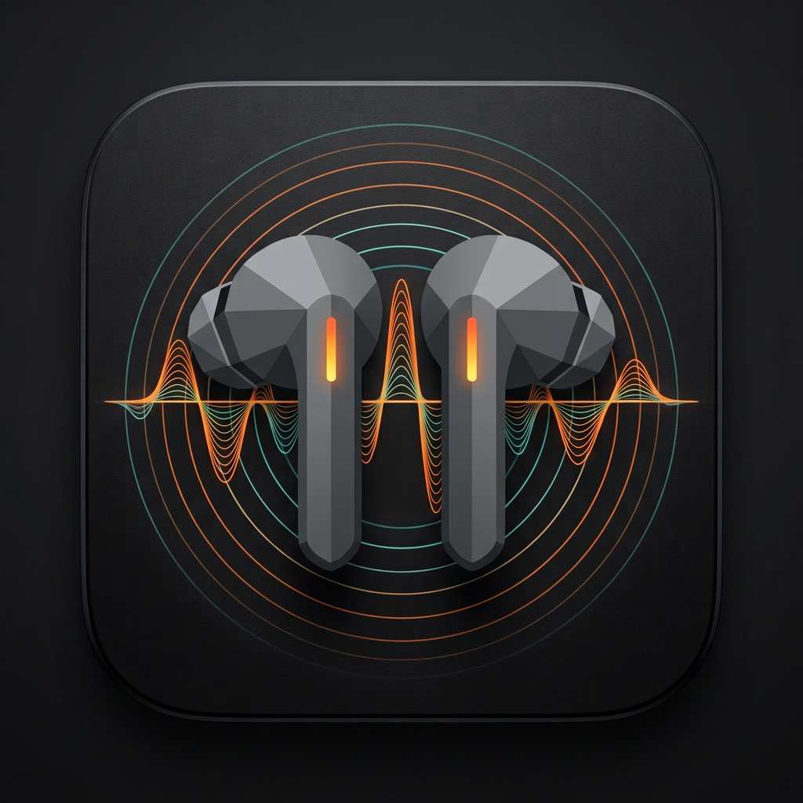

# SoundControl [Soundcore Desktop & Web Companion]

<p align="center">
  
</p>

<p align="center">
  <b>Complete Web App & Windows App companion for Anker Soundcore earbuds and headphones.</b><br>
  Engineered to replicate 100% of the core audio DSP and hardware control capabilities from the official Soundcore Android app without bloat, accounts, or telemetry.
</p>

<p align="center">
  <a href="LICENSE"></a>
  
  
  
</p>

---

## 🚀 Two Ways to Use: Web App or Windows Desktop App

### 1. 🌐 Web App (Browser Version)
- **Live Deployment**: Access the web app hosted directly via GitHub Pages:  
  **`https://shankers8811.github.io/soundcontrol/`**
- **Browser Compatibility**: Chrome, Edge, Brave, or Opera (version 117+) on Windows, macOS, Linux, or ChromeOS.
- **Connection**: Connects directly via the **Web Bluetooth API** (GATT Service `0000ffe0-0000-1000-8000-00805f9b34fb`).
- **Installable PWA**: Click the Install icon in your browser address bar to install SoundControl as a standalone desktop application.
- **Demo Mode**: Includes full offline simulation with realistic hardware models and audio synthesis if no physical device is connected.

### 2. 💻 Windows Desktop App (Electron & Native EXE)

**⬇️ Direct download (recommended) — no build required:**

| Download | File | Notes |
|---|---|---|
| 🪟 **Windows app (installer)** | [`SoundControl-Setup-1.0.1.exe`](https://github.com/Shankers8811/soundcontrol/releases/latest/download/SoundControl-Setup-1.0.1.exe) | NSIS setup, Start-menu & desktop shortcuts |

- All builds and release notes live on the **[Releases page](https://github.com/Shankers8811/soundcontrol/releases/latest)**.
- The same **Download for Windows** button is built into the app under **Settings → About → Desktop extras**.
- Windows SmartScreen may show an unsigned-publisher prompt on first run (the app is free and not code-signed); choose **More info → Run anyway** — see [Code signing & SmartScreen](#-code-signing--smartscreen) for how to make that warning disappear.

**🔎 Connecting earbuds on Windows (important).** A browser-style scan only sees earbuds that
are in **pairing mode** — buds already connected to your laptop are invisible to it, and the
desktop app cannot use Web Bluetooth at all (Electron implements it on Linux only). The desktop
app instead talks to devices **already paired with Windows** through a small local bridge that
runs on a Python runtime **bundled inside the installer** — no Python to install, nothing to configure:

1. Pair the earbuds in **Settings → Bluetooth & devices** and leave them connected.
2. Launch SoundControl → **Add device** → **Refresh paired devices**. Your paired buds are listed
   automatically (even while playing audio) — tap to connect. If the list stays empty, use the
   **Connect by MAC** field (the address appears in Settings → device → Device properties).
   The helper's start-up is logged to `%AppData%\soundcontrol\main.log`.

The very first launch after installing can take a few extra seconds while Windows inspects a
freshly downloaded app — it is not hung. If SmartScreen appears, choose **More info → Run anyway**
(see [Code signing & SmartScreen](#-code-signing--smartscreen)).

Prefer no installs at all? Open the [web app](https://shankers8811.github.io/soundcontrol/) in Chrome
or Edge and put the earbuds in pairing mode instead (open the case, hold its button ~3s).

**Or build/run it yourself from source.** Run directly on Windows with hardware Bluetooth support:
  ```cmd
  git clone https://github.com/Shankers8811/soundcontrol.git
  cd soundcontrol
  npm install
  npm run electron
  ```
- **Quick One-Click Launch**: Double-click **`start-windows.bat`**.
- **Build Windows Executable (.exe)**: Double-click **`build-windows-exe.bat`** or run:
  ```cmd
  npm run build:win
  ```
  The packaged NSIS setup installer `.exe` will be generated in the **`release/`** directory.

---

## 🎧 Complete Android App Feature Parity

| Feature | Official Android App | SoundControl (Web & Windows) |
|---|:---:|:---:|
| **Ambient Sound (ANC)** | ✅ 5-Level Manual, Adaptive, Multi-Scene | ✅ Level 1–5, Adaptive, Transport/Outdoor/Indoor |
| **Transparency Mode** | ✅ Fully Transparent & Talk Mode | ✅ Fully Transparent & Talk Mode |
| **Equalizer Presets** | ✅ 22 Soundcore Curated Presets | ✅ All 22 Exact Soundcore Presets |
| **Custom Graphic EQ** | ✅ 8-Band Slider Curve (-6 to +6 dB) | ✅ Interactive 8-Band SVG Bezier EQ |
| **BassUp™ Technology** | ✅ Dynamic Low-End Boost | ✅ Dynamic BassUp Command & Curve |
| **HearID Sound** | ✅ Dual-Ear Frequency Test & Audiogram | ✅ Interactive Left/Right Web Audio Test |
| **Superior Sleep** | ✅ Ambient White Noise Mixer | ✅ Procedural Nature Sound Synthesizer |
| **Touch Remapping** | ✅ 1-Tap, 2-Tap, 3-Tap, Hold per ear | ✅ Left & Right Earbud Gestures |
| **Game Mode** | ✅ 80ms Low Latency | ✅ 0x87 Packet Low-Latency Switch |
| **LDAC High-Res** | ✅ Sony 990 kbps Codec Flip | ✅ LDAC Query & Command Dispatch |
| **Dual Connection** | ✅ Multipoint PC + Phone | ✅ Dual Connection Command 0x84 |
| **Safe Volume** | ✅ Decibel Limiter & Warnings | ✅ Interactive Volume Limiter |
| **Find My Device** | ✅ Acoustic Locator Chirps | ✅ Left/Right/Both Audio Beacon |
| **Diagnostics / Console**| ❌ Hidden / Unavailable | ✅ Live Hex Frame Inspector & TX/RX Logger |

---

## 🔬 Protocol Reverse Engineering & Technical Architecture

The official Soundcore Android application (`com.oceanwing.soundcore`) communicates with Soundcore Bluetooth hardware using two primary protocols:

1. **Bluetooth Low Energy (BLE)**: Custom GATT service UUID `0000ffe0-0000-1000-8000-00805f9b34fb` with characteristic `0000ffe1-0000-1000-8000-00805f9b34fb` (and companion notify UUIDs).
2. **Bluetooth Classic RFCOMM (SPP)**: Bound to Channel 4 (or Channels 12/15 on Q-series over-ear models).

### Packet Framing & Checksum Calculation

Every packet transmitted between the host application and the hardware device follows the standard Anker frame format:

```text
[Header: 2 bytes] [Prefix: 3 bytes] [Category: 1 byte] [Command: 1 byte] [Length: 2 bytes] [Payload: N bytes] [Checksum: 1 byte]
```

- **Host Transmission (TX)** starts with magic header `0x08 0xEE`.
- **Device Reception (RX)** starts with magic header `0x09 0xFF`.
- **Additive Checksum**: Sum of all preceding bytes in the frame modulo 256:
  $$\text{Checksum} = \left(\sum_{i=0}^{L-1} \text{byte}[i]\right) \pmod{256}$$

### Decompiled Command Categories

- **Category `0x01` (System / Device Management)**:
  - `0x01`: Handshake initialization & query firmware telemetry.
  - `0x7F` / `0xFF`: LDAC High-Resolution audio query and enable/disable.
  - `0x87`: Low-latency Game Mode toggle.
  - `0x88`: Find My Device acoustic beacon.
  - `0x85`: Factory reset device configuration.
- **Category `0x02` (Audio DSP & Equalizer)**:
  - `0x81`: 8-Band Graphic EQ. Target bands: 100 Hz, 200 Hz, 400 Hz, 800 Hz, 1.6 kHz, 3.2 kHz, 6.4 kHz, 12.8 kHz.
  - `0x82`: BassUp dynamic bass boost flag.
  - `0x86`: 3D Spatial Audio / Surround Sound toggle.
- **Category `0x06` (Ambient Sound & ANC)**:
  - `0x81`: Ambient mode selector. Mode `0x00` = ANC, `0x01` = Normal, `0x02` = Transparency. For TWS models, level byte ranges from `0x01` (Min) to `0x05` (Max).
- **Category `0x08` (Touch & Button Controls)**:
  - Mapping gesture indices (Single tap, Double tap, Triple tap, Long press) to action IDs (Volume, Play/Pause, Skip, ANC cycle, Voice Assistant).
- **Category `0x0B` (Connectivity)**:
  - `0x84`: Dual Connection (Multipoint pairing) toggle.

---

## 🛠️ Development & Building

### Prerequisites
- Node.js 18+ (Node 20 or 22 recommended)
- **Python 3.9+** — only for running the bridge from source. Release installers carry their own
  bundled Python runtime (`python-embed/`, fetched automatically by `npm run fetch:python-embed`
  during `npm run build:win`), so desktop users install nothing extra. The web app in Chrome/Edge
  needs no Python either.

### Setup & Development Server
```bash
npm install
npm run dev
```
Preview at `http://localhost:5173`.

### Build for Web Production
```bash
npm run build
```
Generates production assets in `dist/`.

### Package Windows Desktop App
```bash
npm run build:win
```
Generates the NSIS Windows installer (`SoundControl Setup <version>.exe`) in `release/`.

### Publish a new Windows Release
Tagged commits are built and published automatically by the **Release Windows**
workflow (`.github/workflows/release-windows.yml`). It builds the NSIS installer
on `windows-latest`, creates a GitHub Release, and attaches the single
`SoundControl-Setup-<version>.exe` asset:

```bash
git tag v1.0.1 main
git push origin v1.0.1
```

The in-app download button and the links above resolve through
`releases/latest/download/...`, so they always point at the newest Release.

### 🔏 Code signing & SmartScreen
By default the installer is **unsigned**, so first-time downloaders see the
SmartScreen "Windows protected your PC — Unknown publisher" prompt. It is not a
virus check failure; click **More info → Run anyway**, or right-click the file →
**Properties → Unblock** before launching. The prompt can only be removed with an
Authenticode code-signing certificate — nothing in the build config can suppress it.

To sign releases, add two repository secrets (Settings → Secrets and variables → Actions):

| Secret | Value |
|---|---|
| `WINDOWS_CERTIFICATE_BASE64` | base64 text of the `.p12`/`.pfx` file (e.g. `openssl base64 -in cert.p12 -out cert.b64`) |
| `WINDOWS_CERTIFICATE_PASSWORD` | the certificate password |

The Release workflow picks them up automatically and electron-builder signs the app
and the installer; the cleanup step deletes the certificate after the build.
Certificate options: an **EV** cert clears SmartScreen instantly, an **OV** cert
builds reputation over time, and the [SignPath Foundation](https://signpath.org/)
provides **free** code signing for qualifying open-source projects.

---

## 📜 Legal & Disclaimer

SoundControl is an independent, open-source project and is **not** affiliated with, endorsed by, or sponsored by Anker Innovations Limited or Soundcore. All product names, trademarks, and registered trademarks (such as "soundcore", "Liberty", "Space One", "BassUp") are property of their respective owners. Reverse-engineered protocol specifications are documented for interoperability and accessibility purposes under standard fair use guidelines.
