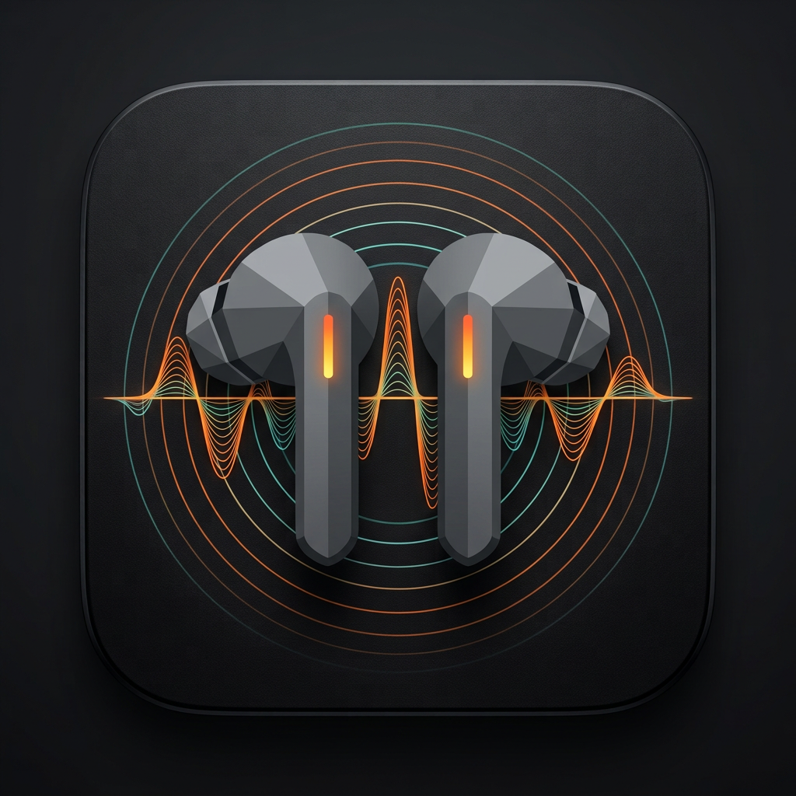

# SoundControl — Windows & Linux Desktop Companion

<p align="center">
  
</p>

<p align="center">
  <a href="LICENSE"></a>
  
  <a href="https://github.com/Shankers8811/soundcontrol/releases/latest"></a>
  <a href="https://github.com/Shankers8811/soundcontrol/actions/workflows/tests.yml"></a>
  <a href="https://github.com/Shankers8811/soundcontrol/actions/workflows/build-windows.yml"></a>
  <a href="https://github.com/Shankers8811/soundcontrol/actions/workflows/smoke-windows.yml"></a>
</p>

SoundControl is a **Windows and Linux desktop companion for Soundcore devices**. It uses a local Bluetooth bridge and evidence-backed protocol profiles for model-aware controls, battery telemetry and diagnostics. Supported controls depend on the connected model: unsupported commands remain blocked, and manual profile selection cannot bypass the model gate. Devices must already be paired and connected through the host's Bluetooth settings; some profiles are read-only or catalog-only. This is not an Android app.

## Build Status

Live status for `main`:

- [Tests](https://github.com/Shankers8811/soundcontrol/actions/workflows/tests.yml) — live
- [Windows Build](https://github.com/Shankers8811/soundcontrol/actions/workflows/build-windows.yml) — live
- [Windows Desktop Smoke Test](https://github.com/Shankers8811/soundcontrol/actions/workflows/smoke-windows.yml) — live

The repository currently requires all three checks to pass before a validated `main` change is considered ready. CI is automated validation; it is not physical Soundcore-device or Windows audio-regression validation.

**Install or download:** Linux AppImage and Debian packages are available below, and a **Windows testing installer** is available from the [Windows test-installer pre-release](https://github.com/Shankers8811/soundcontrol/releases/tag/v1.0.7-windows-unsigned-1). That build is **not Authenticode-signed** (Windows may show a SmartScreen / "unknown publisher" prompt); it is published for Windows 11 / Windows desktop testing. Official signed Windows publication still requires Authenticode signing. The Windows Build badge above shows live GitHub Actions status for `main`, not a signed-release indicator.

---

## Windows & Linux Desktop App

**⬇️ Direct downloads (recommended) — no build required:**

**Latest stable release (Linux):** [v1.0.7-linux-validation-3](https://github.com/Shankers8811/soundcontrol/releases/tag/v1.0.7-linux-validation-3) (assets checked 2026-09-30). It contains `SoundControl.AppImage`, `SoundControl-1.0.7.AppImage`, `SoundControl.deb`, and `soundcontrol_1.0.7_amd64.deb`.

**Windows testing installer:** the [v1.0.7-windows-unsigned-1 pre-release](https://github.com/Shankers8811/soundcontrol/releases/tag/v1.0.7-windows-unsigned-1) publishes the already-tested Windows Build CI installer. It is a pre-release and is **not Authenticode-signed** — see the Windows section below.

### 🪟 Windows

[**Download `SoundControl-Setup.exe`**](https://github.com/Shankers8811/soundcontrol/releases/download/v1.0.7-windows-unsigned-1/SoundControl-Setup.exe) — Windows testing installer (not Authenticode-signed), 121,528,415 bytes, for **Windows 11 / Windows desktop testing**.

**Testing build:** this installer is not Authenticode-signed, so Windows may display a SmartScreen / "unknown publisher" prompt when you download or run it — expected for a testing build. Verify the download first:

```powershell
Get-FileHash .\SoundControl-Setup.exe -Algorithm SHA256
# SHA256  97E256F630C3AB2AFA4F54C5D8A50113F4127268F39E6613C16DDB8C3A90338A
```

(or in cmd: `certutil -hashfile SoundControl-Setup.exe SHA256`)

This is the installer from the artifact `SoundControl-Windows-Test-Unsigned` (artifact ID 11110509686) produced by [Windows Build run 36742600478](https://github.com/Shankers8811/soundcontrol/actions/runs/36742600478), and it is the same installer that passed the [Windows Desktop Smoke Test run 36742600260](https://github.com/Shankers8811/soundcontrol/actions/runs/36742600260) on the same commit. It ships an NSIS installer with Start-menu and desktop shortcuts and a bundled Bluetooth runtime, so it needs no Node.js or Python installation. CI install/smoke checks are **not** physical Soundcore-device hardware validation — the [hardware validation record](HARDWARE-VALIDATION.md) is unchanged and still lists what has and has not been tested on real hardware.

An **official Windows release** remains gated on Authenticode signing: it is published through the Release Windows workflow, which requires a valid code-signing certificate and the `WIN_CSC_LINK` and `WIN_CSC_KEY_PASSWORD` credentials (or their documented aliases) and verifies a real signature before publishing. A passing Windows Build workflow, a local `npm run build:win` result, or this unsigned installer is **not** a signed Windows release.

### 🐧 Linux AppImage

[**Download `SoundControl.AppImage`**](https://github.com/Shankers8811/soundcontrol/releases/download/v1.0.7-linux-validation-3/SoundControl.AppImage)

On a Linux desktop with a working BlueZ adapter, `bluetoothd`, and `bluetoothctl`:

```bash
chmod +x SoundControl.AppImage
./SoundControl.AppImage
```

### 📦 Debian / Ubuntu

[**Download `SoundControl.deb`**](https://github.com/Shankers8811/soundcontrol/releases/download/v1.0.7-linux-validation-3/SoundControl.deb)

On Debian or Ubuntu, install the downloaded file with `sudo apt install ./SoundControl.deb`
(or use your package installer), then launch SoundControl from the application menu.
Both published Linux packages bundle Electron and the Python bridge runtime — no separate Node.js or Python installation is needed; the host still supplies the BlueZ Bluetooth stack.

### 🔗 Release history

[**View all releases and release notes**](https://github.com/Shankers8811/soundcontrol/releases)

- Release links are built into the app under **Settings → About**.
- Official Windows releases are required to pass Authenticode signing before publication. The Windows installer published under [v1.0.7-windows-unsigned-1](https://github.com/Shankers8811/soundcontrol/releases/tag/v1.0.7-windows-unsigned-1) is a CI test build on a pre-release, not a signed or production release; it is not Authenticode-signed.
- **Lifecycle is deliberately boring:** SoundControl starts only when you launch it (it never
  registers a Windows startup entry, and a startup entry left by an older version is removed at
  launch), and closing the window exits completely — the Bluetooth helper is terminated, port
  8765 is released, and nothing keeps running in the tray or background. There is no
  launch-at-login or minimize-to-tray setting by design; obsolete entries in an old
  `%AppData%\soundcontrol\settings.json` are stripped at startup so they can never re-enable
  either behaviour. The complete installed package stays far below 500 MB (measured on Windows CI).
- More docs: [TROUBLESHOOTING.md](TROUBLESHOOTING.md) (every connect failure mode, explained from the real log messages), [ROADMAP.md](ROADMAP.md) (shipped vs open), [PROTOCOL.md](PROTOCOL.md) (verified wire spec), [PUBLISH.md](PUBLISH.md) (release checklist), [docs/WINDOWS-CODE-SIGNING.md](docs/WINDOWS-CODE-SIGNING.md) (SmartScreen & Authenticode signing).

**🔎 Connecting earbuds on Windows/Linux (important).** SoundControl talks to devices **already
paired with the host computer** through a small local Bluetooth bridge:

1. Pair the earbuds in the host's Bluetooth settings and leave them connected. Windows uses its
   paired-device/PnP view; Linux uses the BlueZ `bluetoothctl` view.
2. Launch SoundControl → **Devices**. The page automatically polls the host Bluetooth stack and
   lists detected devices without requiring a manual scan. Select a Soundcore device and press
   **Connect** to open its RFCOMM control channel. **Device Connectivity** displays the
   connection and identification status. A verified model is shown automatically by default;
   **Change device model** is a secondary troubleshooting action, not a required setup step.
   When identification is uncertain or mismatched, **Select model manually** offers only existing
   verified protocol profiles. A manual candidate is limited to the connected Bluetooth address
   and this session: it cannot override automatic identification or command gates. A later
   confirmed automatic identity takes precedence, and **Reset to automatic detection** removes
   a candidate. The **Disconnect** button closes
   the session; SoundControl also watches that exact host Bluetooth address and clears telemetry
   after a confirmed host-side disconnect. If the list stays empty, use the **Connect by
   address** field (the address appears in the host Bluetooth device details).
   The helper's start-up is logged to the app's platform-specific log folder (Windows: `%AppData%\soundcontrol\main.log`; Linux: `~/.config/soundcontrol/main.log`).
   The helper only listens on `127.0.0.1`, answers the app's own origins (never
   `Access-Control-Allow-Origin: *`), and requires a per-session token the desktop
   app mints on every launch — so an untrusted local caller can neither enumerate your
   paired devices nor write to them — see [SECURITY.md](.github/SECURITY.md).

The very first launch after installing can take a few extra seconds while the desktop runtime
initializes — it is not hung. Official Windows releases must be Authenticode-signed before distribution (see [Code signing & SmartScreen](#-code-signing--smartscreen)); the separately published Windows test installer is unsigned and labelled as such.

**Or build/run it yourself from source.** Run directly on Windows or Linux with hardware Bluetooth support:
  ```bash
  git clone https://github.com/Shankers8811/soundcontrol.git
  cd soundcontrol
  npm install
  npm run electron
  ```
- **Quick One-Click Launch**: Double-click **`start-windows.bat`**.
- **Build Windows Executable (.exe)**: Double-click **`build-windows-exe.bat`** or run:
  ```cmd
  npm run build:win
  ```
  The packaged NSIS setup installer `.exe` will be generated in the **`release/`** directory.
- **Build Linux packages**:
  ```bash
  npm run build:linux
  ```
  AppImage and Debian packages are generated in **`release/`**. Linux packages bundle the Python bridge runtime; the host still needs a working BlueZ adapter, `bluetoothd`, and `bluetoothctl`.

---

## Model support

SoundControl keeps a separate profile for each verified SKU instead of
assuming that a shared marketing name implies a shared packet layout. The
current table includes R50i/P20i/A20i, C30i, AeroClip, V20i, Sport X20,
C50i, Life Note 3S (A3945, read-only), P31i/R60i NC, Sleep A30, Liberty 4 NC, Liberty 3 Pro, Space A40,
Liberty 4 Pro, P40i, Liberty 5, Q20i (also sold as Q21i NC on the same A3004
SKU), Space One, Space Q45, Life Q35, Life Q30, Life Tune / Life Tune XR,
Life Tune Pro (A3030, routed to the documented Q35 layout by the upstream
device table), Space One Pro and Q11i, plus the read-only Space 2 profile, the catalog-only over-ear identities (including Space NC A3021, Life 2 NC A3024, Life 2 Neo/Q10i A3033 and the legacy Life/Q/Vortex rows) and the catalog-only Life U2, Life U2i/R500 and Life NC neckband identities. Profiles carry their aliases, battery scale/offset, state offsets,
`06:81` layout, EQ command and toggle capabilities together; the transport
gate refuses a command that does not belong to the connected profile.

Space 2 (D1402) is identified as a **read-only** profile. Its published
channel-30 transport, unlock handshake and 53-byte `03:87` HearID template
are documented in `PROTOCOL.md`, but the current desktop bridge does not
attempt that transport or send those writes yet. Unknown and unverified model
names remain read-only universal telemetry rather than borrowing a sibling's
protocol.

The layouts and evidence matrix are pinned by `npm run verify:protocol`,
`npm run test:models`, `npm run test:simulator`, `npm run test:ui`, and the
automated per-model feature/ANC frame matrix (`npm run test:matrix`); see the
state-offset table in [PROTOCOL.md](PROTOCOL.md) for the exact offsets and
source projects. The current-market inventory, regional aliases, catalog-only
rows, and simulator/unit-test status are tracked in
[`docs/MARKET-COMPATIBILITY.md`](docs/MARKET-COMPATIBILITY.md); the
headset-side coverage matrix — including the legacy Life/Q/Vortex identities
and the FCC-confirmed Space NC (A3021) / Life 2 NC (A3024) identities added on
2026-10-01 that stay catalog-only because their packet layout is not
public — is in
[`docs/HEADSET-MODEL-COVERAGE.md`](docs/HEADSET-MODEL-COVERAGE.md). The explicit
per-model `06:81` ANC layout / mode / level / validation matrix — including the
invalid values the model gate rejects — is in
[`docs/ANC-SOUND-MODE-MATRIX.md`](docs/ANC-SOUND-MODE-MATRIX.md). The separate
[Windows hardware validation record](HARDWARE-VALIDATION.md) tracks the
unperformed physical-device test plan. Catalog-only models are identified
exactly but do not get guessed device controls.

The detailed follow-up per-model query/write/ACK/readback audit is in
[docs/ANDROID-PARITY-INVESTIGATION.md](docs/ANDROID-PARITY-INVESTIGATION.md).

## 🎧 Windows & Linux desktop feature coverage

This is a Windows/Linux app, not an Android build. A ✅ denotes a documented, implemented model-gated feature; the case readout does not add a write. A ⚠️ means evidence exists but the desktop lifecycle is incomplete; ❌ means not safely implemented. See [PROTOCOL.md](PROTOCOL.md) for confidence and lifecycle details. The [per-model investigation matrix](docs/ANDROID-PARITY-INVESTIGATION.md) distinguishes VERIFIED/IMPLEMENTED readouts from VERIFIED BUT UNSAFE/INCOMPLETE writes, PARTIAL references, UNKNOWN protocols and UNSUPPORTED cross-model guesses.

| **Feature** | **Official soundcore mobile app (comparison only; model-dependent)** | **SoundControl for Windows & Linux** |
|---|:---:|:---:|
| **Ambient Sound (ANC)** | Model-dependent ANC, adaptive modes and scene controls | ✅ Real `06:81` frames with per-model layouts: classic 4-byte, Space/Q45 6-byte, and model-specific TWS 6-/7-byte forms. Only fields documented for the exact profile are exposed |
| **Transparency Mode** | Model-dependent transparency controls; some models expose fully transparent and vocal/talk modes | ✅ Real `06:81` transparency control where the exact profile documents it; vocal/fully-transparent sub-modes are only shown when that model has the corresponding field |
| **Equalizer Presets** | Up to 22 factory presets on supported devices | ✅ 22 captured factory presets on EQ-capable profiles using the model's real `02:81`, `02:83`, or D1202 `03:87` disabled-HearID form; personalized HearID writes remain disabled |
| **Custom Graphic EQ** | Custom EQ on supported devices | ✅ 8-band −6…+6 dB curve using the real `FE FE` custom frame on profiles that document custom presets; factory-preset-only profiles such as A3949 keep custom editing disabled |
| **Per-earbud connection state** | Live left/right status on supported TWS devices | ✅ Device-reported battery/availability state; `0xFF` means that side is not connected. Unknown side state stays distinct from host control-link disconnection |
| **BassUp™ Technology** | Model-dependent BassUp control | ⚠️ No verified generic BassUp setter/`02:82`. Space Q45 BassUp double-press assignment and A3945's separate `01:01` BassUp boolean are displayed read-only; neither is exposed as a writable BassUp control |
| **HearID Sound** | HearID hearing test and personalized sound on supported models | ⚠️ No desktop audiogram/test workflow. Model-specific personalized HearID writes are not exposed because they lack a safe read/verify/reconnect lifecycle; D1202 factory presets use its documented disabled-HearID form |
| **Superior Sleep** | Sleep-specific audio/timer features on supported Sleep models | ⚠️ No sleep mixer. Sleep A30 (D1301) reads the device-reported after-sleep Bluetooth/local-audio choice from `01:01`, read-only. Timer/alarm queries are documented but no timer/alarm writes are sent |
| **Touch Remapping** | Model-dependent button/touch customization | ⚠️ Public model-specific `04:81`/related writes exist, but SoundControl has no validated per-SKU read/verify/reconnect lifecycle. Editing remains disabled; Q45 double-press and A3945's six assignments are read-only observations |
| **Game Mode** | Model-dependent low-latency/Game Mode | ✅ Real `01:87` toggle, with the `10:85` Liberty 4 NC/Liberty 5 variant where documented |
| **LDAC High-Res** | LDAC on supported Android-compatible models | ✅ Real `01:7F` query + `01:FF` enable/disable on profiles that document LDAC |
| **Dual Connection** | Multipoint on supported models | ✅ Real `0B:84` toggle on profiles that document Dual Connection |
| **3D Surround / spatial modes** | Spatial Audio on supported models; modes vary by product | ⚠️ `02:86` only on documented models. A3954 music/podcast/movie/gaming plus fixed/head-tracking and D1202 music/movie/gaming are currently **read-only state displays**, not editable modes |
| **Device Volume** | Model-dependent app/device volume controls | ⚠️ No desktop device-volume control. The A3116 Motion+ `01:81` reference write is speaker-specific, has no supported A3116 profile here, and is blocked; SoundControl never sends it to earbuds |
| **Safe Volume** | Safe Volume / volume-limit controls on supported models | ⚠️ Public `20:82 [enabled, limit]` (75–100 dB in 5 dB steps) exists for specific SKUs. Current settings are shown read-only on A3040/A3954/D1202; no editing without model-scoped post-write/reconnect verification. This is not host volume |
| **Factory reset** | Reset controls are available through the mobile app for supported devices | ⚠️ `01:85` is documented only for Motion+ (A3116); no A3116 profile exists here and the helper blocks the destructive frame |
| **Capability gating** | UI varies by connected model | ✅ Every desktop page adapts to the verified model; unsupported controls show a disabled state with the protocol reason |
| **Diagnostics / Console** | Not exposed as a raw protocol console | ✅ Live Hex Frame Inspector and TX/RX Logger |
| **Battery telemetry** | Live L/R/case levels where supported by the device | ✅ L/R levels with 30 s bud refresh; read-only case charge from the verified `01:01` state on 11 documented SKUs only. `0xFF`/invalid clears case; host Bluetooth % is separate and never used to invent case/over-ear telemetry |
| **Capture decoding** | Not exposed as a raw capture decoder | ✅ Base64→Hex + BLE→RFCOMM map in Diagnostics |

This table describes **protocol-backed desktop capabilities**, not physical-device certification. A `✅` means the feature is implemented behind an exact model/capability gate; it does not mean SoundControl has physically validated that SKU. A `⚠️` means reference/read-only evidence exists but the desktop write lifecycle is incomplete or intentionally withheld.

---

## 🔬 Protocol Reverse Engineering & Technical Architecture

The Windows/Linux desktop app communicates with Soundcore Bluetooth hardware over:

1. **Bluetooth Classic RFCOMM (SPP)**: the DSP channel is model-dependent (4 on most earbuds, 10 on the P20i family, 12/15 on several over-ears, 30 on Space 2). The helper probes each candidate with the `01:01` handshake and keeps the first channel that answers with a valid `09 FF` frame — accepting a socket alone is not proof (see PROTOCOL.md).
2. **Local Electron-to-helper IPC**: The packaged renderer talks to the Python helper over an authenticated loopback HTTP/WebSocket connection; the helper performs the RFCOMM work. Liveness uses the fast `/health` endpoint; `/scan` enumerates Windows PnP devices or Linux BlueZ devices (slow on cold adapters, cached 3 s) and is polled automatically while the Devices page is open.

### Packet Framing & Checksum Calculation

Every packet transmitted between the host application and the hardware device follows the standard Anker frame format:

```text
[Header: 2 bytes] [Prefix: 3 bytes] [Category: 1 byte] [Command: 1 byte] [Length: 2 bytes] [Payload: N bytes] [Checksum: 1 byte]
```

- **Host Transmission (TX)** starts with magic header `0x08 0xEE`.
- **Device Reception (RX)** starts with magic header `0x09 0xFF`.
- **Additive Checksum**: Sum of all preceding bytes in the frame modulo 256:
  $$\text{Checksum} = \left(\sum_{i=0}^{L-1} \text{byte}[i]\right) \pmod{256}$$

### Decompiled Command Categories

- **Category `0x01` (System / Device Management)**:
  - `0x01`: Handshake / full state query (also the channel-probe frame).
  - `0x03` / `0x04`: live battery levels / charging flags.
  - `0x05`: serial + firmware (ASCII).
  - `0x7F` / `0xFF`: LDAC High-Resolution audio query and enable/disable.
  - `0x87`: Low-latency Game Mode toggle (`10:85` on Liberty 4 NC / Liberty 5).
  - `0x85`: Factory reset — documented only for the Motion+ A3116 speaker. No A3116 profile is available here; the helper blocks this destructive frame.
- **Category `0x02` (Audio DSP & Equalizer)**:
  - `0x81`: 8-Band Graphic EQ (classic over-ears). Target bands: 100 Hz, 200 Hz, 400 Hz, 800 Hz, 1.6 kHz, 3.2 kHz, 6.4 kHz, 12.8 kHz.
  - `0x83`: 10-band EQ + DRC compensation channel (P20i/P30i family) — byte-identical to 22 live captures.
  - `0x86`: 3D Surround Sound toggle.
  - No verified generic `02:82` BassUp toggle. A3945 reports a strict read-only BassUp byte at state offset 70; Space Q45 has a `BassUp=7` *button mapping* in the public `04:81` reference. Neither is a SoundControl BassUp setter.
- **Category `0x03`**: `0x87` is the model-specific HearID EQ used by Liberty 4 NC, Space One, Space Q45, Space A40, Liberty 4 Pro, P40i, Liberty 5, Space One Pro and Space 2. Layout differs per model and risks overwriting measured hearing profiles, so SoundControl disables those writes instead of guessing.
- **Category `0x06` (Ambient Sound & ANC)**:
  - `0x81`: sound-mode selector with per-model layouts. Classic Q20i/Q30/Q35/Life Tune models use the four-byte body; Space One/Space Q45, Space One Pro, Space A40, Liberty 4 Pro, P40i and Liberty 5 use their documented six- or seven-byte bodies (manual level, adaptive, wind and model-specific scene fields). Inbound mirror is `06:01`.
- **Category `0x08` (Touch & Button Controls)**:
  - Model-specific `04:81` action writes exist (`04:83` enabled and A3945 `04:84` bulk variants); no validated ACK→fresh read→reconnect write lifecycle exists in SoundControl. Q45 double-press and A3945 left/right single, double and long-press assignments are safely displayed from exact `01:01` layouts; the mapping editor stays disabled.
- **Category `0x0B` (Connectivity)**:
  - `0x84`: Dual Connection (Multipoint pairing) toggle.

### Android BLE captures (decode-only)

The desktop app does **not** use Web Bluetooth — Electron has no reliable BLE stack in this renderer, and the local helper reaches hardware over RFCOMM. Android BLE captures are still documented in [PROTOCOL.md](PROTOCOL.md#appendix-a--android-ble-captures-decode-only-reference) so they can be decoded in **Diagnostics → Base64 capture → hex** and mapped to the RFCOMM frames above:

| BLE capture | RFCOMM equivalent |
|---|---|
| `0x61` telemetry request | `01 01` handshake + `01 03` battery query |
| `0x06` ANC toggle | `06 81` ambient frame |
| `0x01` EQ gain array | `02 81` 8-band EQ frame |

BLE frames use an XOR checksum; RFCOMM frames use the additive Σ checksum. The diagnostics console shows both, and `src/protocol/ble.ts` holds the GATT UUIDs (`ab00` service, `ab01` TX, `ab02` RX) plus the parsers.

### Troubleshooting connections

- **"Bluetooth helper: not responding"** means the renderer could not reach `/health`. Restart SoundControl and check the platform log folder for `bridge started via …` or a Python startup error. The status no longer depends on the slow PnP/BlueZ scan, so a slow adapter will not false-positive.
- **Empty paired-device list** with the helper running means the host has no paired RFCOMM device to enumerate. Pair in the computer’s Bluetooth settings, keep the device connected, then use **Scan devices** on the Devices page (which forces a fresh `?fresh=1` scan).
- **Battery stuck?** The app re-queries `01 03` every 30 s while connected to real hardware and falls back to the host Bluetooth percentage when protocol telemetry is unavailable.

---

## 🛠️ Development & Building

### Prerequisites
- **Node.js 20.19+ or 22.12+** (Node 22 recommended) — Vite 8 refuses older runtimes
- **Python 3.9+** — needed only for source runs. Windows release installers fetch a bundled runtime
  automatically during `npm run build:win`; Linux packages stage a relocated runtime automatically
  during `npm run build:linux`. Linux users still need BlueZ (`bluetoothd` and `bluetoothctl`).

### Development
```bash
npm install
npm run dev
```

This starts the local Vite renderer used while developing the Windows/Linux Electron app.
Use `npm run electron` with the renderer available when testing the desktop shell.

### Tests
```bash
npm test            # everything below in sequence
npm run test:ui     # pure UI state derivation (capabilities, earbud presence, battery math, scan machine) + a server-side render smoke of every page
npm run test:bridge # Python bridge unit tests (channel probe, token/origin auth, WS protocol)
npm run test:simulator # documented profiles exercise fixtures; catalog-only profiles are rejected
npm run test:e2e    # startup/lifecycle e2e: real helper server + real renderer transport against an emulated RFCOMM device (incl. per-side earbud telemetry)
npm run test:lifecycle # main-process exit/restart races: window close kills the real helper, port 8765 frees, no post-shutdown restart (Electron stubbed; Windows CI repeats this against the packaged app)
```
None of these need Windows, Bluetooth hardware, or an Electron binary; the
emulated helper (`scripts/emulated_bridge.py`) is test data only and is never
packaged into the installer.

### Validation and evidence

Model profiles and wire formats are grounded in documented per-model reference
implementations and published captures; see [PROTOCOL.md](PROTOCOL.md).
SoundControl's automated parser, simulator, transport, UI and packaged-desktop
CI checks validate the implementation without asserting a Bluetooth session
with a physical Soundcore device. Physical-device validation has not been
performed in this workspace; the separate
[hardware checklist](HARDWARE-VALIDATION.md) explains how to record it.
The prior Windows smoke runner had no audio endpoints, so it did not perform
an audio-regression comparison. Neither a simulator pass nor an upstream
hardware observation substitutes for SoundControl hardware testing.

### App icon (SC monogram)
Every shipped icon raster — window, taskbar, desktop shortcut, installer and
browser-tab favicon — is rendered from one vector source,
`assets/icon/sc-monogram.svg`:

```bash
npm i --no-save @resvg/resvg-js   # generation-time tool only
node scripts/generate-icons.mjs   # rewrites public/icon-*.png + favicon-64.png
```

The generated PNGs are committed, so builds, CI and packaging never need the
rasterizer; it is deliberately not a `package.json` dependency. Regenerate
only when the vector source changes and commit all sizes together so the
icon set stays pixel-consistent.

### Build the renderer
```bash
npm run build
```
Generates the renderer assets in `dist/` for packaging into the desktop app.

### Package Windows Desktop App
```bash
npm run build:win
```
Generates the NSIS Windows installer (`SoundControl Setup <version>.exe`) in `release/`.

### Package Linux Desktop App
```bash
npm run build:linux
```
Generates AppImage and Debian (`.deb`) packages in `release/`. Linux packages carry the Python
bridge runtime and use the host's BlueZ stack; install `bluetoothd` and `bluetoothctl` before
launching the app.

#### Upgrading an existing installation

The installer is configured as an assisted NSIS installer with the permanent
application ID `com.soundcontrol.desktop`. Running a newer
`SoundControl-Setup.exe` detects an existing per-user or per-machine SoundControl
installation, closes the running app when needed, reuses its installation
location, and replaces the old application files instead of installing a
side-by-side copy. App data is preserved during this upgrade. Do not change the
application ID in `package.json`, because it is the Windows upgrade identity.

The Windows CI smoke test installs the package, marks that installation as an
older version, and runs the same installer again without an install-directory
override to verify the in-place upgrade path.

### Publish a new Windows Release
Tagged commits are built and published automatically by the **Release Windows**
workflow (`.github/workflows/release-windows.yml`). It builds the NSIS installer
on `windows-latest`, creates a GitHub Release with one stable installer asset:
`SoundControl-Setup.exe`. The in-app downloader checks the latest release assets and only offers a link when that installer is actually attached:

```bash
# Bump "version" in package.json first so the release metadata stays accurate.
git tag vX.Y.Z main
git push origin vX.Y.Z
```

The in-app downloader queries the latest release and shows only assets that exist. Linux stable aliases are attached by the Linux release workflow.

Separately from that signed path, `.github/workflows/publish-windows-test-installer.yml` makes the **already-built, already-tested** unsigned CI installer (artifact `SoundControl-Windows-Test-Unsigned`) publicly downloadable by republishing it unchanged to a clearly labelled pre-release (`v1.0.7-windows-unsigned-1`). It does not build or sign anything, verifies the artifact digest and the installer SHA-256 before uploading, refuses to touch any release that is not a pre-release, and leaves every signing gate in the Release Windows workflow untouched.

### 🔏 Code signing & SmartScreen
The Windows signing pipeline is fully implemented and enforced: **release builds are gated on signing** — the release workflow refuses to build without credentials, electron-builder runs with `forceCodeSigning`, and the generated EXE is verified (`Get-AuthenticodeSignature` + `signtool verify /pa`, publisher identity, SHA-256 recorded, every shipped executable signed) before the GitHub Release is published. All details: **[docs/WINDOWS-CODE-SIGNING.md](docs/WINDOWS-CODE-SIGNING.md)**.

The latest stable release contains the Linux packages; the Windows installer on the Releases page ([v1.0.7-windows-unsigned-1](https://github.com/Shankers8811/soundcontrol/releases/tag/v1.0.7-windows-unsigned-1)) is an unsigned CI test build, not a signed release. A signed Windows release requires a valid code-signing certificate and the repository secrets below; the CI certificate-validation step is skipped when they are not configured. To enable signing, set two repository secrets (Settings → Secrets and
variables → Actions):

| Secret | Value |
|---|---|
| `WIN_CSC_LINK` | base64 text of the `.p12`/`.pfx` file (e.g. `openssl base64 -in cert.p12 -out cert.b64 -A`) |
| `WIN_CSC_KEY_PASSWORD` | the certificate password |

(Optionally also set the repository variable `WINDOWS_EXPECTED_PUBLISHER` so
the release gate can pin the expected signer identity.) electron-builder signs
the app, the bundled Python executables, the uninstaller and the installer
with SHA-256 + RFC 3161 timestamping, and the cleanup step deletes the staged
certificate after the build. Until those secrets exist, every attempt to cut a
release fails loudly instead of shipping another unsigned installer.

**Getting a certificate — three routes, cheapest first:**

1. **Free — [SignPath Foundation](https://signpath.org/).** Qualifying
   open-source projects get signing at no cost: apply on the Foundation site,
   and once approved point the workflow at SignPath instead of a local `.p12`
   (the certificate never leaves their HSM, which is also what the CAs now
   require for OV/EV keys).
2. **OV certificate (~$75–200/yr)** from any CA (Sectigo, DigiCert, ssl.com,
   GlobalSign…). Clears the publisher name into the SmartScreen dialog; the
   "Unknown publisher" block fades as the certificate builds download
   reputation over days to weeks.
3. **EV certificate (~$200–400/yr)** — hardware-token or cloud-HSM key.
   SmartScreen reputation is effectively instant; this is the route that makes
   the prompt disappear on the very first download.

**Wiring an existing `.p12`/`.pfx` into this repo:**

```bash
# 1. export/keep your certificate as PKCS#12
openssl pkcs12 -export -out soundcontrol.p12 -inkey key.pem -in cert.pem

# 2. base64 it (single line is fine)
openssl base64 -in soundcontrol.p12 -out soundcontrol.b64 -A

# 3. store the two secrets, then re-run the Release workflow
#    Settings → Secrets and variables → Actions → New repository secret
#      WIN_CSC_LINK          = <contents of soundcontrol.b64>
#      WIN_CSC_KEY_PASSWORD  = <p12 password>
```

Honest expectation: signing makes the publisher verifiable, but a brand-new
signed file can still be considered unrecognized until SmartScreen reputation
builds up from real downloads (EV certificates are the exception with
near-immediate reputation). See
[SmartScreen reputation expectations](docs/WINDOWS-CODE-SIGNING.md#smartscreen-reputation-expectations).

Verify afterwards on any Windows box: right-click the installer → Properties
(the digital signature tab appears), or in PowerShell
`Get-AuthenticodeSignature .\SoundControl-Setup.exe` → `Status : Valid`.

---

## 📜 Legal & Disclaimer

SoundControl is an independent, open-source project and is **not** affiliated with, endorsed by, or sponsored by Anker Innovations Limited or Soundcore. All product names, trademarks, and registered trademarks (such as "soundcore", "Liberty", "Space One", "BassUp") are property of their respective owners. Reverse-engineered protocol specifications are documented for interoperability and accessibility purposes under standard fair use guidelines.
